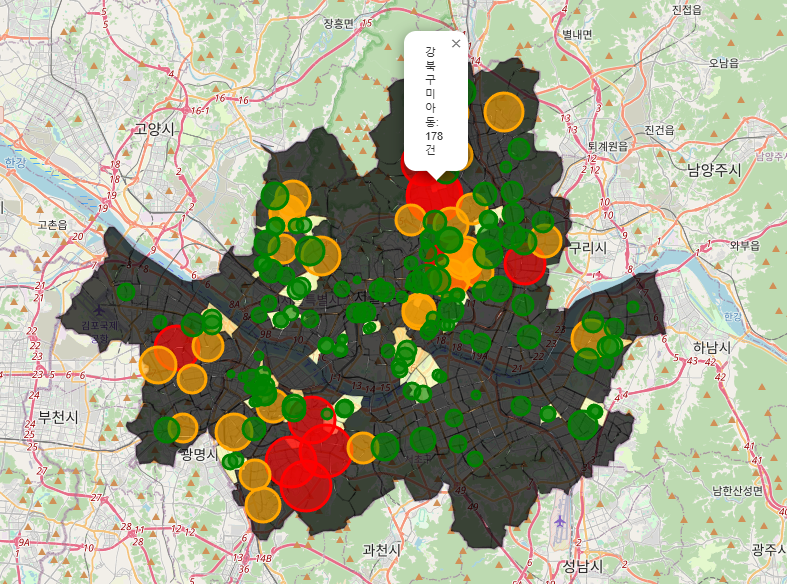
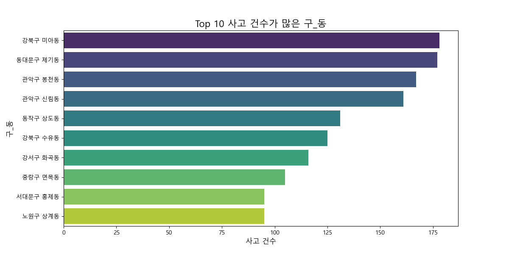
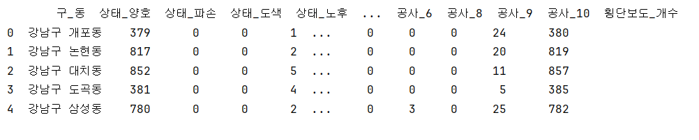

# 2024 빅데이터 프로젝트: 노인교통사고 예방

## 🚶‍♂️️프로젝트 목적🚶‍♂️
서울시 내 교통사고, 특히 노인 사고를 예방하기 위해 횡단보도 정보와 교통사고 데이터를 결합하여 분석합니다. 사고 발생 패턴을 시각화하고, 사고가 빈번한 구역을 파악하여 **노인 보호를 위한 정책 개발**을 돕습니다.  
Choropleth 지도와 사고 위치에 마커를 표시하여, 사고 위험이 높은 지역을 한눈에 볼 수 있도록 합니다.

---

## 🚗프로젝트 흐름

### 1. 데이터 로드 및 전처리
- **서울시 교통안전시설물 횡단보도 정보**와 **교통사고 데이터**를 엑셀 파일에서 불러옵니다.
- 불러온 데이터에서 열 이름의 공백을 제거하고, 필요한 데이터를 정리하여 필요한 정보를 추출합니다.
- **구이름**과 **동이름**을 횡단보도 정보에 추가하고, **구코드**, **동코드**를 기반으로 시군구코드 및 법정동코드를 비교하여 일치하는 행을 찾습니다.

### 2. 데이터 전처리 및 필터링
- **결측값 처리**: 결측치를 0으로 대체하거나 삭제하여 데이터를 정리합니다.
- **불필요한 데이터 필터링**: '공사형태'가 공백인 행을 삭제하고, 횡단보도종류코드가 5나 6인 행을 제거합니다.
- **새로운 열 생성**: 구이름과 동이름을 합쳐 **구_동** 열을 생성하여, 이를 기준으로 각종 분석을 진행합니다.

### 3. 데이터 분석 및 그룹화
- **상태별 분석**: 상태 (공통) 열을 기준으로 상태별 횡단보도 개수를 계산하여 구_동별로 분류합니다.
- **횡단보도종류코드별 분석**: 횡단보도종류코드에 따른 횡단보도 개수를 그룹화하여 각 구_동별로 분석합니다.
- **공사형태별 분석**: 공사형태 (공통)에 따라 공사 형태 개수를 계산하여 결과를 정리합니다.

### 4. 최종 데이터 병합
- 각 분석 결과를 병합하여 **df_final** 데이터프레임을 생성하고, 구_동별로 상태, 횡단보도 종류, 공사 형태, 횡단보도 개수를 포함한 종합적인 결과를 도출합니다.
- **df_final**을 CSV 파일로 저장하여 후속 분석에 활용할 수 있도록 합니다.

---

## 📊 시각화

### 5. 사고 데이터 시각화
- **서울 지도 시각화**: Folium 라이브러리를 사용하여 서울시 행정동 경계 데이터를 불러오고, 각 구_동별 교통사고 건수를 시각적으로 표시합니다.
- **Choropleth 지도**: 사고 건수에 따라 색상을 다르게 하여 사고가 많은 지역을 강조합니다.
- **마커 추가**: 사고가 발생한 위치에 마커를 추가하고, 사고 건수에 따라 마커 색상과 크기를 조정하여 사고 다발 지역을 강조합니다.

---

🗺️  결과물
-
- **서울_사고_경계선_지도.html**: 사고 다발 지역을 시각적으로 표현한 HTML 지도 파일



- **Top 10 사고 건수 많은 구와 동 차트**: 사고 다발 지역을 10위로 분류해 시각적으로 표현한 차트


- **crosswalk_grouped_cleaned.csv**: 횡단보도 상태 및 사고 관련 데이터를 포함한 CSV 파일
 

---

## ⚠️예방할 수 있는 효과

- **고위험 구역 식별**: 사고가 빈번히 발생하는 지역을 시각적으로 확인할 수 있어, 해당 지역에 대해 집중적인 안전 조치와 예방 대책을 마련할 수 있습니다.
- **횡단보도 상태 개선**: 횡단보도의 상태별로 사고 위험을 분석하여 양호한 상태의 횡단보도를 늘리고, 파손이나 노후된 횡단보도를 우선적으로 개선할 수 있습니다.
- **교통사고 예방 정책 수립**: 사고가 자주 발생하는 지역에 대한 교통사고 예방 정책을 수립하고, 이를 실시간 데이터와 함께 모니터링하여 사고를 예방할 수 있습니다.
- **노인 보호**: 특히 노인들이 자주 이용하는 횡단보도와 도로 구역에 대해 특화된 안전 정책을 마련하여 교통사고를 예방할 수 있습니다.
- **사고 예측 및 경고 시스템 개발**: 이 프로젝트를 통해 수집된 데이터를 활용하여 사고를 예측하고 실시간 경고 시스템을 구축하여 사고 발생을 미연에 방지할 수 있습니다.

---

## 사용한 기술 및 라이브러리

- **Pandas**: 데이터 불러오기, 전처리 및 분석
- **Folium**: 지도 시각화
- **Numpy**: 사고 건수 기반 마커 크기 조정
- **Matplotlib**: 데이터 시각화 (선택적)

---

## 프로젝트 실행 방법

📍 **필요한 라이브러리 설치**
```bash
pip install pandas
pip install pandas folium numpy matplotlib
pip install openpyxl
pip install folium
pip install geopandas
pip install seaborn